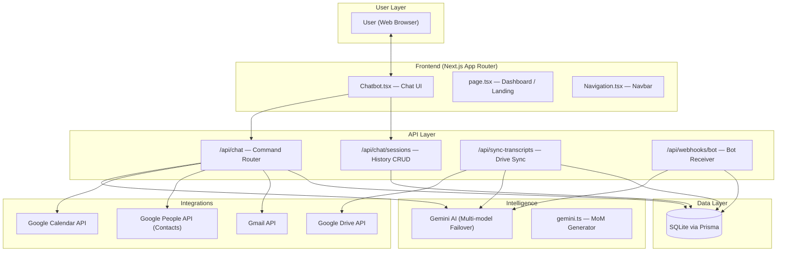

# Vela — AI Meeting Assistant

> Your AI executive assistant for meetings — schedule, transcribe, summarize, and communicate through natural conversation **or voice**.

---

## ✨ Features

| Feature | Description |
|---|---|
| **Smart Scheduling** | Book meetings in plain English; Vela looks up emails from Google Contacts automatically |
| **Meeting Cancellation** | Cancel events by title or attendee; cancellation notices sent to all invitees |
| **MoM Generation** | AI-structured Minutes of Meeting with Summary, Decisions Made, and Action Items |
| **Email MoM** | Send formatted meeting minutes to any attendee — by name or email — directly from chat |
| **Transcript Sync** | Automatically sync Google Meet transcripts from Google Drive and view them inline |
| **Manual Transcript Paste** | Paste any transcript directly into chat to generate MoM instantly |
| **File & Image Upload** | Upload images or `.txt`/`.md`/`.json` files for Vela to analyze using multimodal AI |
| **Voice Input** | Click the mic to dictate messages hands-free — powered by the browser's Web Speech API |
| **Smart Meeting Search** | Find meetings by title keyword, time ("the 3pm meeting"), or attendee name |
| **Chat History & Sessions** | All conversations persist to the database; switch or delete sessions from the sidebar |
| **Calendar View** | See upcoming meetings with "Today" badges and one-click Google Meet join links |
| **Multi-model AI Failover** | Automatically rotates Gemini models if one hits its rate limit |

---

## 🏗️ System Architecture



---

## 🚀 Getting Started

### Prerequisites

- [Node.js](https://nodejs.org/) v18+
- A [Google Cloud Console](https://console.cloud.google.com/) project
- A [Google AI Studio](https://aistudio.google.com/apikey) API key

---

### 1. Clone the Repository

```bash
git clone https://github.com/your-username/vela-meeting-assistant.git
cd vela-meeting-assistant
```

### 2. Install Dependencies

```bash
npm install
```

### 3. Enable Google Cloud APIs

Go to [Google Cloud Console → APIs & Services → Enabled APIs](https://console.cloud.google.com/apis/library) and enable:

- ✅ **Google Calendar API**
- ✅ **Gmail API**
- ✅ **Google People API**
- ✅ **Google Drive API** *(for transcript sync)*

### 4. Create OAuth 2.0 Credentials

1. Go to **APIs & Services → Credentials → Create Credentials → OAuth Client ID**
2. Application type: **Web application**
3. Add Authorized redirect URI: `http://localhost:3000/api/auth/callback/google`
4. Save your **Client ID** and **Client Secret**

### 5. Get a Gemini API Key

1. Visit [https://aistudio.google.com/apikey](https://aistudio.google.com/apikey)
2. Click **Create API Key** and link your Google Cloud project
3. Copy the key

> ⚠️ Use an **AI Studio key** (not a Cloud Console key) to get correct free-tier Gemini quotas.

### 6. Configure Environment Variables

Create a `.env.local` file in the project root:

```bash
cp .env.local.example .env.local
```

Then fill in the values:

```env
# ── Google OAuth ──────────────────────────────────────────
GOOGLE_CLIENT_ID=your_google_client_id_here
GOOGLE_CLIENT_SECRET=your_google_client_secret_here

# ── Gemini AI ─────────────────────────────────────────────
GEMINI_API_KEY=your_gemini_api_key_here

# ── NextAuth ──────────────────────────────────────────────
NEXTAUTH_URL=http://localhost:3000
NEXTAUTH_SECRET=your_random_secret_here   # generate: openssl rand -base64 32

# ── Database (SQLite — do not change for local dev) ───────
DATABASE_URL=file:./dev.db
```

> 🔐 **Never commit `.env.local` or `dev.db` to Git.** Both are excluded in `.gitignore`.

### 7. Initialize the Database

```bash
npx prisma db push
npx prisma generate
```

### 8. Run the Development Server

```bash
npm run dev
```

Open [http://localhost:3000](http://localhost:3000) in your browser.

### 9. Sign In

Click **Sign In with Google** and grant the requested OAuth scopes:
- Google Calendar (read + write)
- Gmail (send)
- Google Contacts (read)
- Google Drive (read — for transcript sync)

---

## 💬 Using Vela

Once signed in, talk to Vela naturally in the chat interface. You can also use **voice input** by clicking the microphone icon.

### Example Commands

```
"What's on my schedule today?"
"Schedule a meeting with Nikita Gupta for tomorrow at 3pm about Q2 Planning"
"Cancel the meeting with Anurag"
"Show me the latest MoM"
"What was discussed in the Q2 Roadmap meeting?"
"Email the meeting minutes to Nikita and Anurag"
"Sync transcripts from Google Drive"
"Join https://meet.google.com/abc-defg-hij"
```

### Voice Mode

Click the **🎤 microphone button** next to the text input to switch to voice mode. The input field turns red and displays *"Listening... speak now"*. Click the button again (now showing MicOff) to stop and review the transcribed text before sending.

> Voice input uses the browser's built-in Web Speech API. Works on Chrome and Edge. Not supported on Firefox.

### File & Image Uploads

Click the **📎 paperclip button** to attach files. Supported types:
- **Images** — `.jpg`, `.png`, `.gif`, `.webp` (analyzed using Gemini multimodal vision)
- **Text files** — `.txt`, `.md`, `.json`, `.csv` (injected as context into the prompt)

> Word (`.docx`) and PDF files are not directly supported. Copy and paste the text content instead.

---

## 🤖 Gemini Multi-model Failover

Vela cycles through Gemini models automatically if one hits its rate limit:

```
gemini-2.5-flash        → Best quality (tried first)
gemini-2.5-flash-lite   → Fallback
gemini-3.0-flash        → Fallback
gemini-3.1-flash-lite   → Most generous free quota (last resort)
```

To override the priority without changing code, add to `.env.local`:

```env
GEMINI_MODEL_LIST=gemini-2.0-flash,gemini-2.5-flash-lite
```

---

## 🗂️ Project Structure

```
ai-meeting-assistant/
├── prisma/
│   └── schema.prisma           # Database schema (User, Meeting, Transcript, MoM, ChatSession, ChatMessage)
├── public/                     # Static assets
└── src/
    ├── app/
    │   ├── api/
    │   │   ├── auth/[...nextauth]/
    │   │   │   └── route.ts    # NextAuth Google OAuth handler
    │   │   ├── chat/
    │   │   │   ├── route.ts    # Main chat API — intent routing, Gemini calls, all commands
    │   │   │   └── sessions/
    │   │   │       ├── route.ts        # GET all sessions for user
    │   │   │       └── [id]/route.ts   # GET messages | DELETE session
    │   │   ├── sync-transcripts/
    │   │   │   └── route.ts    # POST — syncs Google Drive transcripts to DB
    │   │   └── webhooks/bot/
    │   │       └── route.ts    # POST — receives bot transcript, triggers MoM generation
    │   ├── globals.css          # Global styles (glassmorphism, dark theme, animations)
    │   ├── layout.tsx           # Root layout with Navigation and SessionProvider
    │   └── page.tsx             # Home — landing page (signed out) / dashboard (signed in)
    ├── components/
    │   ├── Chatbot.tsx          # Full chat UI: sessions sidebar, bubbles, voice input, file upload
    │   ├── Navigation.tsx       # Top navbar with Vela branding and sign-in/out
    │   └── Providers.tsx        # NextAuth SessionProvider wrapper
    └── lib/
        ├── auth.ts              # NextAuth config: Google OAuth, JWT callbacks, token refresh
        ├── bot/
        │   ├── BotRunner.ts         # Puppeteer-based Google Meet bot launcher
        │   └── GoogleMeetScraper.ts # Live caption scraper inside Meet
        ├── gemini-client.ts     # Multi-model Gemini failover wrapper (text + multimodal image)
        ├── gemini.ts            # MoM generation prompt builder + structured response parser
        ├── google-api.ts        # Google Calendar, Gmail, People API utility functions
        ├── google-drive.ts      # Google Drive file listing and transcript download helpers
        ├── prisma.ts            # Singleton Prisma client instance
        └── transcript-sync.ts   # Two-phase Drive sync (calendar-linked + standalone files)
```

---

## 🗄️ Database Schema

The application uses **SQLite** via **Prisma ORM**. Key models:

| Model | Purpose |
|---|---|
| `User` | Authenticated user (linked to NextAuth accounts) |
| `ChatSession` | A conversation thread (has a title, belongs to a User) |
| `ChatMessage` | A single message in a session (role: user/assistant, optional attachments JSON) |
| `Meeting` | A Google Calendar event (title, URL, start/end time, status) |
| `Transcript` | Raw meeting transcript text (linked to a Meeting or standalone from Drive) |
| `MoM` | Generated Minutes of Meeting (summary, decisions, action items) |

---

## 🔑 Environment Variables Reference

| Variable | Required | Description |
|---|---|---|
| `GOOGLE_CLIENT_ID` | ✅ | OAuth 2.0 Client ID from Google Cloud Console |
| `GOOGLE_CLIENT_SECRET` | ✅ | OAuth 2.0 Client Secret |
| `GEMINI_API_KEY` | ✅ | Google AI Studio API key |
| `NEXTAUTH_URL` | ✅ | Base URL of the app (e.g. `http://localhost:3000`) |
| `NEXTAUTH_SECRET` | ✅ | Random secret for signing session cookies |
| `DATABASE_URL` | ✅ | Prisma DB connection string (default: `file:./dev.db`) |
| `GEMINI_MODEL_LIST` | ❌ | Optional comma-separated Gemini model priority override |

---

## 🔒 Security Notes

- **Secrets** (`GOOGLE_CLIENT_ID`, `GEMINI_API_KEY`, `NEXTAUTH_SECRET`) are stored in `.env.local` — excluded from Git via `.gitignore`
- **OAuth access tokens** are encrypted in the JWT; refresh tokens are stored in the SQLite DB (`dev.db`) — also excluded from Git
- **User data** (transcripts, MoMs, chat history) is stored locally and never sent to third parties beyond Google APIs and Gemini
- **File upload data**: images are sent as base64 to Gemini's API; text content is injected as prompt context — nothing is stored on any external server
- The `NEXTAUTH_SECRET` signs session cookies — use a strong random value (`openssl rand -base64 32`)

---

## 🛠️ Tech Stack

| Layer | Technology |
|---|---|
| **Framework** | [Next.js 15](https://nextjs.org/) (App Router, Turbopack) |
| **Auth** | [NextAuth.js](https://next-auth.js.org/) with Google OAuth 2.0 |
| **AI** | [Google Gemini](https://ai.google.dev/) via `@google/generative-ai` (text + multimodal) |
| **Database** | [Prisma](https://www.prisma.io/) ORM + SQLite |
| **APIs** | Google Calendar, Gmail, People (Contacts), Drive |
| **Voice Input** | Web Speech API (browser-native, no external deps) |
| **Styling** | Vanilla CSS — glassmorphism, dark theme, micro-animations |
| **Icons** | [Lucide React](https://lucide.dev/) |

---

## 📋 Roadmap

- [x] Google Calendar integration (schedule, view, cancel)
- [x] Gmail integration (send MoM emails to multiple recipients)
- [x] Google Contacts integration (name → email lookup)
- [x] Gemini AI chat with intent routing (10 command types)
- [x] MoM generation (summary, decisions, action items)
- [x] Smart meeting search (title, time, attendee name)
- [x] Multi-model Gemini failover
- [x] Vela branded UI (glassmorphism, dark theme)
- [x] Chat session persistence (SQLite + sidebar)
- [x] Chat session deletion
- [x] Google Drive transcript sync (calendar-linked + standalone)
- [x] Manual transcript paste → MoM generation
- [x] File & Image upload (multimodal Gemini vision)
- [x] Voice-to-text input (Web Speech API)
- [ ] Deployment guide (Vercel / Railway / Docker)
- [ ] Puppeteer bot joining live Google Meet sessions

---

## 📄 License

MIT — feel free to fork, extend, and build on top of Vela!
