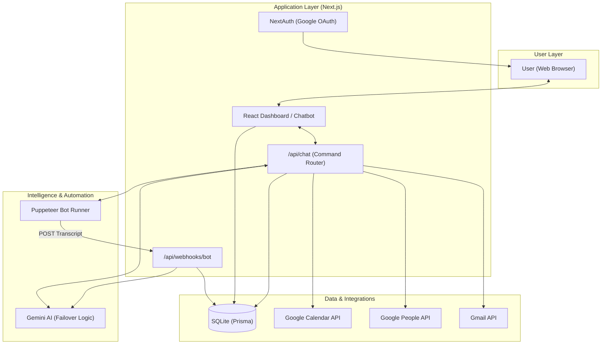

# Vela — AI Meeting Assistant

> Your AI co-pilot for meetings. Schedule, join, capture transcripts, and generate Minutes of Meeting — all through natural conversation.


---

## ✨ Features

| Feature | Description |
|---|---|
| **Smart Scheduling** | Schedule meetings by name — Vela looks up emails from your Google Contacts automatically |
| **Meeting Cancellation** | Cancel events by title or attendee name; cancellation notices sent to all attendees |
| **MoM Generation** | AI-generated Minutes of Meeting with Summary, Decisions, and Action Items |
| **Email MoM** | Send meeting minutes to anyone by name or email directly from chat |
| **Transcript View** | View what was discussed in any past meeting |
| **Smart Meeting Search** | Find meetings by title keyword, time (e.g. "the 3pm meeting"), or attendee name |
| **Calendar View** | See all upcoming meetings with Today badges and direct Join Meet links |
| **Multi-model Failover** | Automatically tries multiple Gemini models if one is rate-limited |

---

## 🏗️ System Architecture



---

## 🚀 Getting Started

### Prerequisites

- [Node.js](https://nodejs.org/) v18+
- A [Google Cloud Console](https://console.cloud.google.com/) project
- A [Google AI Studio](https://aistudio.google.com/apikey) API key

---

### 1. Clone the Repository

```bash
git clone https://github.com/your-username/vela-meeting-assistant.git
cd vela-meeting-assistant
```

### 2. Install Dependencies

```bash
npm install
```

### 3. Set Up Google Cloud Project

You need a Google Cloud project with the following **APIs enabled**. Go to [Google Cloud Console → APIs & Services → Enabled APIs](https://console.cloud.google.com/apis/library):

- ✅ **Google Calendar API**
- ✅ **Gmail API**
- ✅ **Google People API**

Then create **OAuth 2.0 credentials**:

1. Go to **APIs & Services → Credentials → Create Credentials → OAuth Client ID**
2. Application type: **Web application**
3. Add Authorized redirect URI: `http://localhost:3000/api/auth/callback/google`
4. Save your **Client ID** and **Client Secret**

### 4. Get a Gemini API Key

1. Go to [https://aistudio.google.com/apikey](https://aistudio.google.com/apikey)
2. Click **Create API Key** and select your Google Cloud project
3. Copy the key

> ⚠️ Use an **AI Studio key** (not a Cloud Console key) to get proper free-tier quotas for Gemini models.

### 5. Configure Environment Variables

Create a `.env.local` file in the project root:

```bash
cp .env.local.example .env.local
```

Then fill in the values:

```env
# Google OAuth
GOOGLE_CLIENT_ID=your_google_client_id_here
GOOGLE_CLIENT_SECRET=your_google_client_secret_here

# Gemini AI
GEMINI_API_KEY=your_gemini_api_key_here

# NextAuth
NEXTAUTH_URL=http://localhost:3000
NEXTAUTH_SECRET=your_random_secret_here   # generate with: openssl rand -base64 32

# Database (SQLite — do not change for local dev)
DATABASE_URL=file:./dev.db
```

> 🔐 **Never commit `.env.local` or `dev.db` to Git.** They are already in `.gitignore`.

### 6. Set Up the Database

```bash
npx prisma migrate dev --name init
npx prisma generate
```

### 7. Run the Development Server

```bash
npm run dev
```

Open [http://localhost:3000](http://localhost:3000) in your browser.

### 8. Sign In

Click **Sign In with Google** in the top-right corner. Grant the requested permissions:
- Google Calendar (read + write)
- Gmail (send)
- Google Contacts (read)

---

## 💬 Using Vela

Once signed in, talk to Vela naturally in the chat interface:

```
"What's on my schedule today?"
"Schedule a meeting with Nikita Gupta for tomorrow at 3pm"
"Cancel the meeting with Anurag"
"Show me the latest MoM"
"What was discussed in the Q2 Roadmap meeting?"
"Email the meeting minutes to Nikita Gupta"
"Join https://meet.google.com/abc-defg-hij"
```

---

## 🤖 Gemini Model Failover

Vela automatically rotates through multiple Gemini models if one hits its rate limit:

```
gemini-2.5-flash         (best quality, tries first)
gemini-2.5-flash-lite    (fallback)
gemini-3.0-flash         (fallback)
gemini-3.1-flash-lite    (most generous free quota, last resort)
```

To override the model list without changing code, add to `.env.local`:

```env
GEMINI_MODEL_LIST=gemini-2.0-flash,gemini-2.5-flash-lite
```

---

## 🗂️ Project Structure

```
src/
├── app/
│   ├── api/
│   │   ├── auth/          # NextAuth Google OAuth handlers
│   │   ├── chat/          # Main chat command router (8 commands)
│   │   └── webhooks/bot/  # Bot transcript receiver + auto MoM trigger
│   ├── globals.css        # Global styles (glassmorphism, animations)
│   ├── layout.tsx         # App shell with Navigation
│   └── page.tsx           # Main dashboard (calendar sidebar + chat)
├── components/
│   ├── Chatbot.tsx        # Chat UI (bubbles, typing indicator, quick actions)
│   ├── Navigation.tsx     # Vela branded navbar
│   └── Providers.tsx      # NextAuth session provider
└── lib/
    ├── auth.ts            # NextAuth config with Google OAuth + token refresh
    ├── bot/
    │   ├── BotRunner.ts        # Puppeteer bot launcher (Phase 10)
    │   └── GoogleMeetScraper.ts # Caption scraper
    ├── gemini-client.ts   # Multi-model failover Gemini wrapper
    ├── gemini.ts          # MoM generation prompt + parser
    └── google-api.ts      # Calendar, Gmail, Contacts API utilities
prisma/
└── schema.prisma          # SQLite schema (User, Meeting, Transcript, MoM)
```

---

## 🔑 Environment Variables Reference

| Variable | Required | Description |
|---|---|---|
| `GOOGLE_CLIENT_ID` | ✅ | OAuth 2.0 Client ID from Google Cloud Console |
| `GOOGLE_CLIENT_SECRET` | ✅ | OAuth 2.0 Client Secret |
| `GEMINI_API_KEY` | ✅ | Google AI Studio API key |
| `NEXTAUTH_URL` | ✅ | Base URL of the app (e.g. `http://localhost:3000`) |
| `NEXTAUTH_SECRET` | ✅ | Random secret for session signing |
| `DATABASE_URL` | ✅ | Prisma DB connection string (default: `file:./dev.db`) |
| `GEMINI_MODEL_LIST` | ❌ | Comma-separated override for model priority |

---

## 🔒 Security Notes

- **API keys** are stored in `.env.local`, which is listed in `.gitignore` and never committed
- **OAuth tokens** are stored in the SQLite database (`dev.db`), also in `.gitignore`
- **User data** (transcripts, MoMs) is stored locally and never sent to third parties except Google APIs and Gemini
- The `NEXTAUTH_SECRET` is used to sign session cookies — keep it strong and private

---

## 🛠️ Tech Stack

- **Framework**: [Next.js 16](https://nextjs.org/) (App Router)
- **Auth**: [NextAuth.js](https://next-auth.js.org/) with Google OAuth
- **AI**: [Google Gemini](https://ai.google.dev/) via `@google/generative-ai`
- **Database**: [Prisma](https://www.prisma.io/) + SQLite
- **Meeting Bot**: [Puppeteer](https://pptr.dev/) (Phase 10 — in progress)
- **APIs**: Google Calendar, Gmail, People (Contacts)
- **Styling**: Vanilla CSS with glassmorphism + CSS animations

---

## 📋 Roadmap

- [x] Google Calendar integration (schedule, view, cancel)
- [x] Gmail integration (send MoM emails)
- [x] Google Contacts integration (name → email lookup)
- [x] Gemini AI chat interface with command routing
- [x] MoM generation (summary, decisions, action items)
- [x] Smart meeting search (by title, time, attendee name)
- [x] Multi-model Gemini failover
- [x] Vela branded UI (glassmorphism, dark theme)
- [ ] **Phase 10**: Puppeteer bot joining live Google Meet sessions
- [ ] Parallel meeting recording (multiple bots simultaneously)
- [ ] Deployment guide (Vercel / Railway)

---

## 📄 License

MIT — feel free to fork and build on top of Vela!
